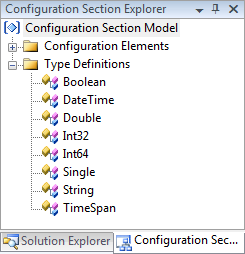
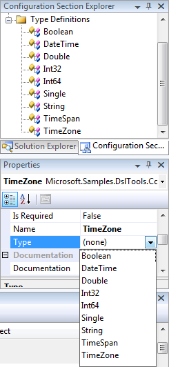
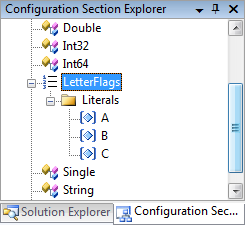

# Defining new types

When setting the Type property attributes, you get a drop-down that contains a number of types that the Configuration Section Designer comes configured with by default. These types are the most common primitive .NET types, such as _string_ and _int_ as well as two date/time related types, _DateTime_ and _TimeSpan_. Sometimes, it is desirable to add more types to the Configuration Section Designer, like your own custom classes or enums.

## External types

You add more external types to the Configuration Section Designer by opening the Configuration Section Explorer pane (if it is not visible, go **View -> Other Windows -> Configuration Section Explorer**). You will see one node that contains all the configuration elements (these are the same that are shown on the design surface), and one node that contains the type definitions.

To add a new type, right-click the root node, _Configuration Section Model_, and select **Add new External Type**. Right-click the new type, and select **Properties**. The type must be fully qualified by namespace and type name. This type will now show up in the _Type_ drop-downs of attributes. In the image below, you can see that I have added the _System.TimeZone_ type to the _Type Defintions_, and that I can now use it as a type for my properties.

## Enumerated types

You can also define Enumerated Types (enums). Unlike the external types, which are only references to existing types, these get code generated for them, and they get a proper XML Schema definition for full IntelliSense support. Support for using external enums is possible as well. These will not get code generated for them, but will still be put in the XML Schema.

As with the external types, you add more external types to the Configuration Section Designer by opening the Configuration Section Explorer pane. To add a new enumeration, right-click the root node, _Configuration Section Model_, and select **Add new Enumerated Type**. Right-click the new type, and select **Properties**. You must set the namespace, otherwise you'll get a validation error. You can also set the _IsFlags_ property to true if this enumeration is an enumeration of flags. Finally, if this is a reference to an external enumeration, set the _Code Generation Options_ to _None_. This will prevent the enumeration from being generated in the code, while still providing strong typing in the XML Schema.

You can now right click your new enumerated type and select **Add New Enumeration Literal** as many times as necessary. These are the values of the enumeration. Here's an example enumeration type that I created:

That should be all you need to know in order to define new types.