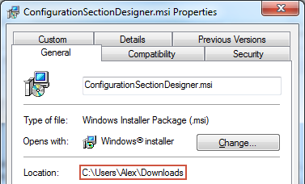

# Installation Visual Studio 2008

First, download the latest 1.x version of the [Configuration Section Designer](http://csd.codeplex.com/Release/ProjectReleases.aspx) if you haven't done so already. Extract the contents of the zip file. Two files will be extracted, the installation package (ConfigurationSectionDesigner.msi) and a readme file (Readme.htm).

Before proceeding with the installation, make sure you close any open Visual Studio instances.

## Windows XP

To install this application, you must be logged in on an Administrator account. Just double click the ConfigurationSectionDesigner.msi to start the installation.

## Windows Vista & Windows 7

To install the Configuration Section Designer you must start the installation from an elevated command prompt. To start an elevated command prompt, open the start menu, and in the search field, type "cmd". The file "cmd.exe" should appear.

Right-click the file and select "Run as administrator".

Unless disabled, a User Account Control dialog will show up to confirm that you want to run the command prompt in an elevated state. Select "Yes". In the command prompt that now showed up, enter the full path to the installation file you extracted earlier. To get the full path, right click the ConfigurationSectionDesigner.msi file from before, and select "Properties". The "Location" field will have the path to the folder the file is in.

 Mark the text, copy it, and paste it into the command prompt. At the end of the pasted text, add "\ConfigurationSectionDesigner.msi" and press ENTER.

The installation should now start. When the installation is finished, you may close the command prompt window. Congratulations, you now have the Configuration Section Designer on your system.

## After installing

Next, you may want to read the [documentation on how to use the tool](Usage).